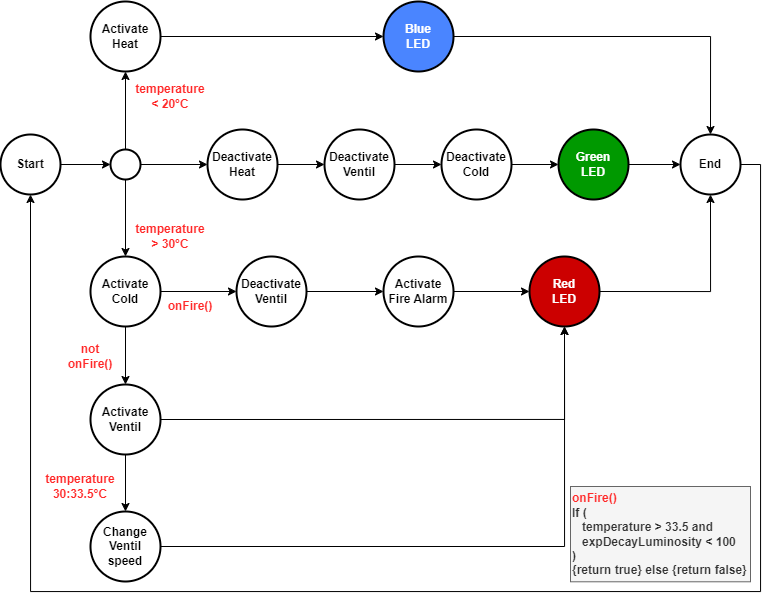

# Master Informatique - IA - IOT 2025 - Delivery 1
### ***Authors:** Arno LESAGE, Nathan THIERY* 

#### **Behaviour of the fire detection**
The behaviour of the fire detection is based on three thresholds:
- `lowThreshold`: initially set to 20.0f, under this value, the heat starts to run,
- `highThreshold`: initially set to 30.0f, over this value, climatisation start to run as well as the ventillation (speed of ventilation is increasing above this threshold until hitting the next one).
- `maxVentil`: initially set to 33.5f, the ventilation reaches its max speed. This threshold correspond to the first condition to ignite the fire detection.

The conditions for the fire detection are based on both luminosity and heat. In order to ignite fire detection, the temperature must rise above the `maxVentil` threshold and the exponential decaying luminosty must be under 100.

The exponential decaying luminosity is computed as:
$$
\text{expDecayLuminosity}(t) =\begin{cases}
    \text{luminosity} & t\le 0\\
    p\cdot \text{luminosity} + (1-p)\cdot\text{expDecayLuminosity}(t-1) & t > 0
\end{cases}
$$
With $t\in\mathbb{Z}$ and $p\in[0,1]$. By default, $p$ is set to 0.3.

This choice to include exponential decay for the light average was motivated by the following reflexion: "If the temperature is already above 33.5°C, should we activate the fire alarm immediatly if someone activate by error his phone torch or wait a bit (but not too long) to be sure something is happening?".

Here is the global flow:

**Important Note:** The thresholds and $p$ can be modified directly from the node-red.

#### **How to use the validator**
The validator can be used directly via the commandline with the command:

    python .\val.py [json] [--fromfile <path>]

It can be used directly by inserting a JSON within the command as in:

    python .\val.py '{"status":{"temperature":23.5,"light":4095,"regul":"HALT","fire":false,"heat":"OFF","cold":"OFF","fanspeed":0},"location":{"room":"282","gps":{"lat":43.61708414,"lon":7.06471621},"address":"Les lucioles"},"regul":{"lt":26,"ht":25.89999962},"info":{"ident":"ESP32 123","user":"AL","loc":"A Biot"},"net":{"uptime":"55","ssid":"Livebox-B870","mac":"AC:67:B2:37:C9:48","ip":"192.168.1.45"},"reporthost":{"target_ip":"127.0.0.1","target_port":1880,"sp":2}}'

or via a path using the flag `--fromfile` as in:

    python .\val.py --fromfile .\tests\test_valid.json

The constraint of the validator includes:
- All expected properties must appears,
- No unexpected properties must appears,
- The `temperature` must be contained within the range $[-70, 150]$,
- The `light` must be contained within the range $[\![0, 4095]\!]$,
- The `fanspeed` must be contained within the range $[\![0, 255]\!]$,
- The properties `heat` and `cold` are either `OFF` or `ON`,
- The IP adresses must be correct (base 10 ipv4 format)
- The type of each properties must be correct. 